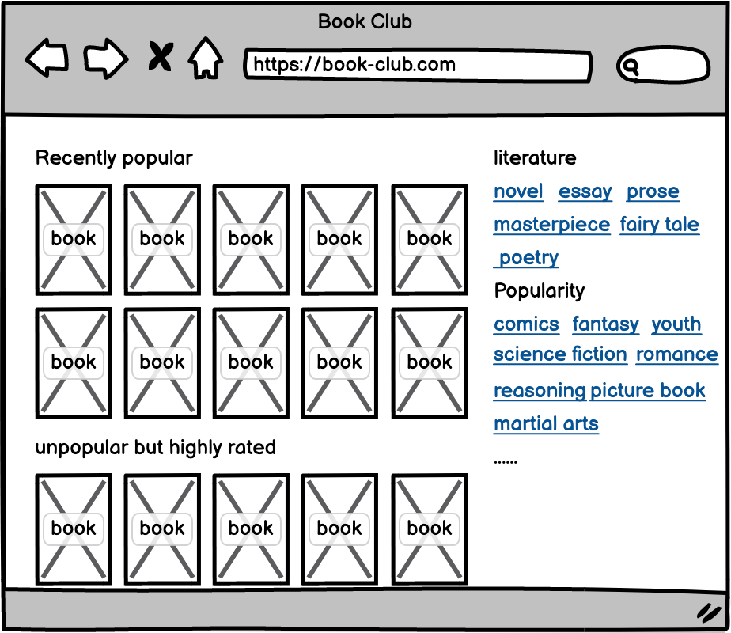
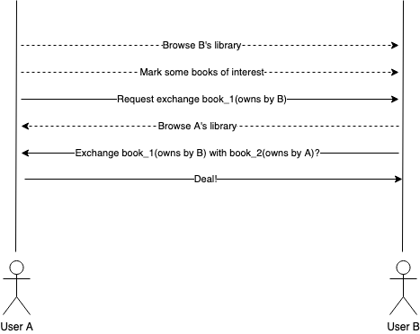
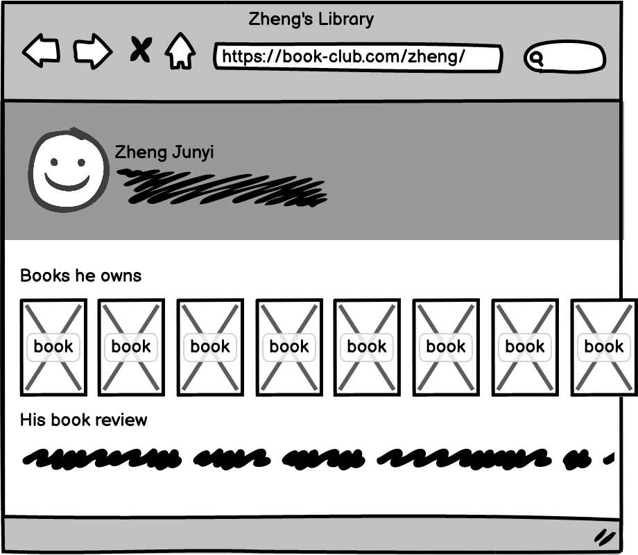

# book-exchange-web

[![test_badge]][test_link] [![build_badge]][build_link] [![codecov_badge]][codecov_link]

A WebApplication for used book exchange (front-end part).

Demo Site: <https://book.mogeko.me>

## Work to be done

This website needs to implement the following functions:

### User Management and Authentication.

Data on this website is uploaded by administrators and users, so we should provide user registration and login functions. Users are allowed to manage all the data they generate on the site, including uploaded book information, reviews of books, ratings of books, likes of other users' reviews, etc.

### Index.

One home page for everyone (both users and non-users). We display recent popular books, popular book reviews on the homepage and a category list of books. At the same time, there will be a section dedicated to less popular but highly rated books.

### Social.

1. Users are allowed to mark books on the site ("Want to Read", "Reading" or "Read"). b) Users are allowed to write book reviews.

2. Users can "like", or "dislike" book reviews written by others, or comment on book reviews.

3. Users can rate books they have read.

### Search.

Search for books by book title, book description, author, ISBN number and other information. Search to the user home page (library) by username or user email.

###  Exchange books.

Allows users to exchange books they own with each other. The exchange of books is based on the principle of user's voluntary, barter. The website

provides information only, and the exchange of specific books will take place offline.

### Personal library.

This will be the basis of "Social" and "Book Exchange". A user can search from official databases and add books to his personal library. Books that are not in the official database can also be uploaded manually by users themselves. Books in the library can be browsed by other users. All user-authored book reviews are also grouped here.

## License

The code in this project is released under the [MIT License](LICENSE).

<!-- badges -->
[test_badge]: https://github.com/mogeko/book-exchange-web/actions/workflows/test.yml/badge.svg
[build_badge]: https://github.com/mogeko/book-exchange-web/actions/workflows/build.yml/badge.svg
[codecov_badge]: https://codecov.io/gh/mogeko/book-exchange-web/branch/master/graph/badge.svg?token=g4f1T2nsMm

<!-- links -->
[test_link]: https://github.com/mogeko/book-exchange-web/actions/workflows/test.yml
[build_link]: https://github.com/mogeko/book-exchange-web/actions/workflows/build.yml
[codecov_link]: https://codecov.io/gh/mogeko/book-exchange-web
